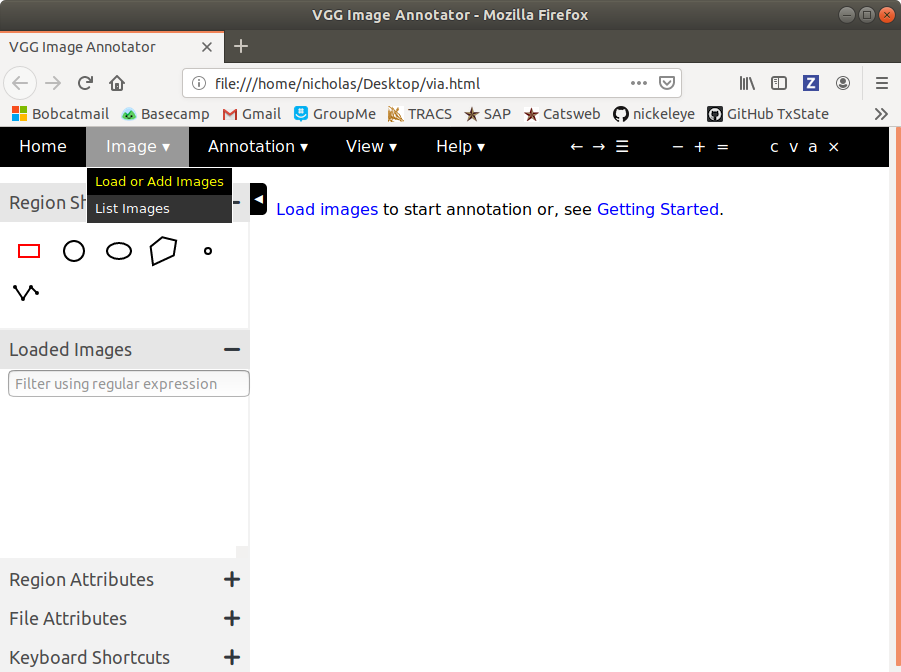
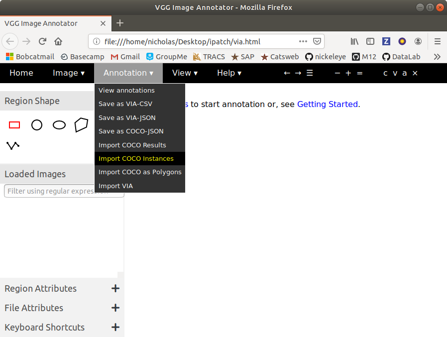
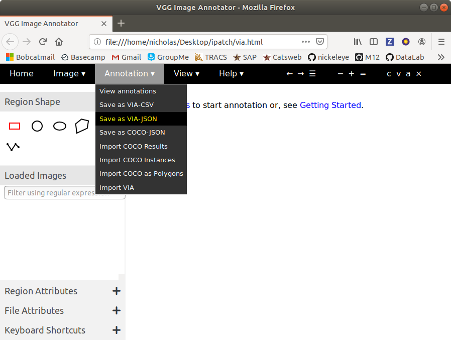

# This project is a modifications of [VGG](http://www.robots.ox.ac.uk/~vgg/) Image Annotator [(VIA)](http://www.robots.ox.ac.uk/~vgg/software/via/) Version 1.0.5

VIA is an image tool for visualizing and editiing object detection datasets. It allows the user to determine quality of annotations to the integrity of a dataset. It gives users the ability to edit or remove incorrect or malformed annotations. The user can also create new annotations to increase the size of the dataset.

VGG created this tool to be used with their VIA formatted object detection annotations. We modified the project to be compatible with Microsoft's Common Objects in Contects([COCO](http://cocodataset.org/#home)) format.

# COCOized Format

  <b>Load Images<b>
    

___

  I<b>mport Annotation File</b> 
      

___

  <b>Edit Annotations</b>
    

___

  <b>Save as COCO</b>
     

 ___

## License
VIA is an open source project released under the
[BSD-2 clause license](https://gitlab.com/vgg/via/blob/master/LICENSE).
