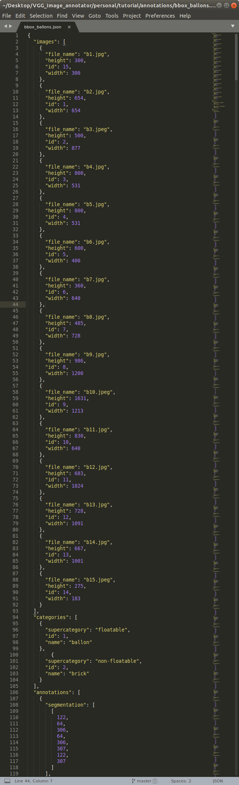

# Common Objects in Context [format](http://cocodataset.org/#format-data)

* annotations/empty_ballons.json has image list and category list. Can add annotations with VIA.
* annotations/bbox_ballons.json has annotations and can train with it.
* Corresponding images are in image folder.

# Example of COCO data format for Object Detection

___

## License
VIA is an open source project released under the
[BSD-2 clause license](https://gitlab.com/vgg/via/blob/master/LICENSE).
